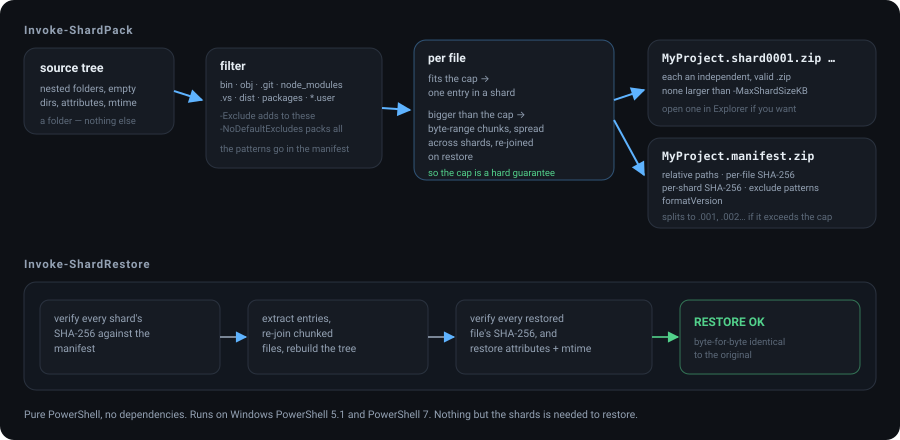
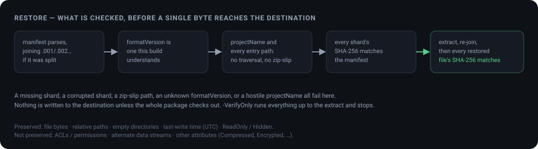

<div align="center">

# Shard

**Split a project into small shards. Reforge it byte-for-byte.**

Two pure-PowerShell scripts: one splits a project folder into many small `.zip` shards (default
cap 500 KB, configurable) with an integrity manifest; the other reassembles the exact original
tree from just those shards — nothing else about the project required.

No external dependencies. Files larger than the shard cap are split into byte-range chunks spread
across shards and re-joined on restore, so the cap is a hard guarantee: no shard, and no manifest
part, is ever larger than the size you specify.

[](#testing)
[](#testing)
[](#restore--what-is-checked)
[](LICENSE)



</div>

---

## Usage

**Pack a project:**

```powershell
.\Invoke-ShardPack.ps1 -SourcePath C:\src\MyProject -OutputPath C:\out\MyProject-pkg
```

This writes `MyProject.shard0001.zip … shardNNNN.zip` plus
`MyProject.manifest.zip` (or, if the manifest itself is too big for one
shard, `MyProject.manifest.zip.001`, `.002`, …) into `C:\out\MyProject-pkg`.

Change the shard size cap with `-MaxShardSizeKB` (default 500, minimum 8):

```powershell
.\Invoke-ShardPack.ps1 -SourcePath .\MyProject -OutputPath .\pkg -MaxShardSizeKB 200
```

**What gets left out.** Build output and tool folders are skipped by default -
`bin`, `obj`, `node_modules`, `.git`, `.vs`, `dist`, `packages`, `*.user` and
similar - because every byte of them is reproducible from what is kept, and
`.git` is routinely larger than the tree it tracks. The pack summary always
says how many files were skipped, and the manifest records the patterns, so a
restored tree can be read as "the original minus these" rather than guessed at.

```powershell
# your patterns are added to the defaults, not used instead of them
.\Invoke-ShardPack.ps1 -SourcePath .\MyProject -OutputPath .\pkg -Exclude '*.mp4','scratch'

# pack absolutely everything
.\Invoke-ShardPack.ps1 -SourcePath .\MyProject -OutputPath .\pkg -NoDefaultExcludes
```

Patterns match with `-like` against each path segment and against the whole
relative path, so `bin` excludes `src\App\bin\x.dll` without needing a `*`. A
directory matching a pattern is dropped along with its contents; a directory
that merely ends up empty because its *contents* were excluded is still
restored, so the tree keeps its shape.

**Restore a project**, run inside (or pointed at) the folder holding the
shards:

```powershell
cd C:\out\MyProject-pkg
C:\path\to\Invoke-ShardRestore.ps1
```

With no arguments, this restores into a new folder named after the original
project, created in the current directory. Other options:

```powershell
# Check the package is complete and uncorrupted without extracting anything
.\Invoke-ShardRestore.ps1 -VerifyOnly

# Restore to a specific location
.\Invoke-ShardRestore.ps1 -PackagePath C:\out\MyProject-pkg -DestinationPath C:\src\MyProject

# Overwrite an existing destination folder
.\Invoke-ShardRestore.ps1 -Force
```

Restore always verifies every shard's hash before extracting anything, and
every restored file's hash afterward — a `RESTORE OK` line means the
reassembled tree is byte-for-byte identical to the original.

## Restore — what is checked



## Limitations

| Limitation | Detail |
|---|---|
| Shard size | Guaranteed ≤ `-MaxShardSizeKB` for every shard and manifest part — large files are chunked, so there is no "oversized shard" exception. |
| Path length | Paths ≥ 260 characters are rejected before packing (PowerShell 5.1 / .NET Framework do not reliably support long paths). |
| Metadata preserved | File bytes, relative paths, empty directories, last-write timestamp (UTC), and the ReadOnly/Hidden attributes. |
| Metadata **not** preserved | ACLs/permissions, alternate data streams, and attributes other than ReadOnly/Hidden (e.g. Compressed, Encrypted). |
| Manifest integrity | The manifest zip itself is not hash-protected (there's nothing earlier to check it against). Corruption there is still caught downstream: it fails JSON parsing, the `formatVersion` check, or the per-shard/per-file hash checks during restore. |
| Excluded by default | Build output and tool folders (see above). `-NoDefaultExcludes` packs everything, and the manifest always records which patterns were applied. |
| Performance | Dominated by per-file cost rather than by bytes: 3,000 small files pack in ~7s and restore in ~12s on Windows PowerShell 5.1, and ~9s of that restore is Windows creating the files - not recoverable from this end. Very small caps on large projects produce many shards (a 100 MB project at a 50 KB cap is ~2,100 of them). PowerShell 7 is faster throughout. |

## When you may not need this

- **A single archive is fine** → use `Compress-Archive` / `Expand-Archive`.
- **You want true file-spanning volumes without a manifest** → use 7-Zip's
  `7z a -v<size>` split archives.

`shard` exists for the specific combination those don't offer: pure
PowerShell, independently valid plain `.zip` shards, tiny configurable shard
sizes via file chunking, and a manifest that gives you missing-shard and
corruption detection before you commit to a restore.

## Testing

`Test-Shard.ps1` is a self-contained proof — it builds a fixture tree
(nested folders, empty directories, hidden/read-only files, a zero-byte
file, a Unicode filename, and a large incompressible file that forces
chunking), packs it, restores it (including the manifest-split/join path),
and independently verifies the result. It also covers the exclusion rules —
defaults, added patterns, `-NoDefaultExcludes`, and the difference between a
directory that was excluded and one merely left empty — and checks that a
missing shard, a corrupted shard, a zip-slip path, an unsupported `formatVersion` and a hostile `projectName`
are all refused before anything is written to the destination.

```powershell
.\Test-Shard.ps1
```

Prints `RESULT: PASS` and exits 0 on success.

## License

MIT — see [LICENSE](LICENSE).

---

<div align="center">
<sub>A shard is a piece you could cut yourself on, or fit back exactly. These are the second kind.</sub>
</div>
